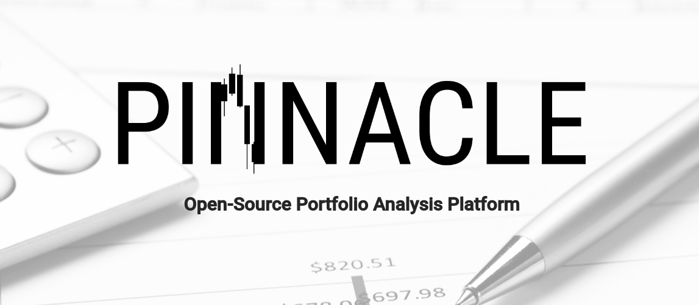

# PINNACLE - Portfolio Analysis Platform

Powerful, open-source portfolio analysis platform designed to help users manage and analyze their financial portfolios effectively. This monorepo project consists of a collection of Spring microservices for backend functionality and an Angular frontend for an intuitive user interface. Pinnacle integrates various technologies, including Kafka, Microsoft SQL Server, and Redis, to provide a comprehensive portfolio management and analysis solution.

## Features

Pinnacle offers a range of features to empower users in their financial analysis and portfolio management efforts:

- **OAuth2 Authentication**: Securely access the platform with OAuth2-based authentication, ensuring the safety and privacy of your financial data.

- **Portfolio CRUD**: Create, read, update, and delete portfolios easily, providing complete control over your financial assets.

- **Portfolio Analysis**: Perform in-depth analysis of your portfolio's performance, including historical data and trends.

- **Stock Analysis**: Get detailed information and analysis on individual stocks, helping you make informed investment decisions.

- **Sector Analysis**: Explore the performance of various sectors in the market to assess their potential for investment.

- **Sector and Company News**: Stay updated with the latest news related to sectors and individual companies, ensuring you are always well-informed.

- **Portfolio Optimization Recommendations**: Receive personalized recommendations for optimizing your portfolio based on your financial goals and risk tolerance.

## Architecture

Pinnacle follows a microservices architecture to provide modularity and scalability. The key components of the system are:

- **Authentication Server**: Handles user authentication and authorization, ensuring the security of your financial data.

- **API Gateway**: Acts as the entry point for external requests, routing them to the appropriate microservices.

- **Findata Operations (findata-ops)**: A library for performing financial analysis operations, serving as the core of the platform's analytical capabilities.

- **Services for Relevant Tasks**: A set of microservices responsible for specific tasks, such as portfolio management, data aggregation, and processing.

## Technologies Used

Pinnacle leverages several cutting-edge technologies to provide a robust and efficient portfolio analysis platform:

- **Spring Microservices**: Utilizing the Spring framework for building microservices to ensure high performance and maintainability.

- **Angular Frontend**: The Angular framework powers the user-friendly interface, providing a seamless experience for users.

- **Kafka**: Kafka facilitates real-time data streaming and processing, enabling timely updates and analysis.

- **Microsoft SQL Server**: A reliable and scalable database solution for storing and managing financial data.

- **Redis**: Redis is used for caching and data retrieval optimization, enhancing the platform's performance.

## Getting Started

To get started with Pinnacle, follow these steps:

1. Clone this repository to your local machine.

2. Set up the required dependencies, including Java, Spring, Angular, and other dependencies mentioned in docker compose.

3. Configure the environment variables and settings according to your needs.

4. Build and deploy the microservices and the Angular frontend.

5. Access the platform via the API Gateway.

For detailed instructions and setup guides, please refer to the individual README files within each component of the monorepo.

## Contributing

Pinnacle is an open-source project, and we welcome contributions from the community. If you'd like to get involved, please check out our [Contribution Guidelines](CONTRIBUTING.md) for more information.

## License

Pinnacle is released under the [MIT License](LICENSE), which means you are free to use, modify, and distribute it for both personal and commercial purposes.

## Support

If you have any questions or need assistance, please feel free to reach out to our support team by [creating an issue](https://github.com/f4pl0/pinnacle/issues).

---

Thank you for choosing Pinnacle as your go-to portfolio analysis platform. We look forward to helping you make informed financial decisions and optimize your investment strategies. Happy investing!